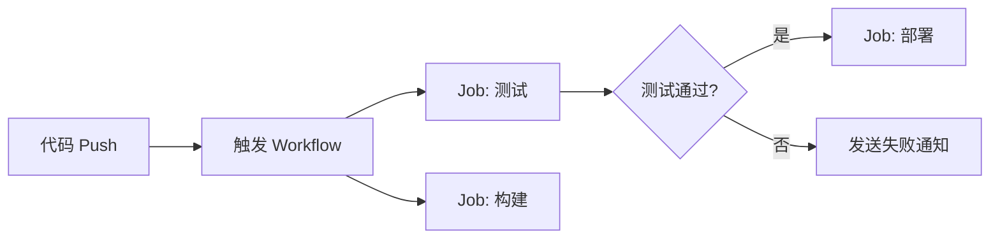

乐富网址下载【Q-——333307——】乐富网址下载【 辋芷《888yx●vip》 】
乐富网址下载【Q-——333307——】乐富网址下载【 辋芷《888yx●vip》 】

 用 GitHub Actions 构建高效自动化工作流：从入门到实践

大家好，我是专注于 DevOps 和云原生技术分享的老赵。今天我们来深入聊聊 GitHub Actions，这个自带 CI/CD 能力的利器。在 2025 年，自动化已成为开发者效率的核心，而 GitHub Actions 凭借其与代码库的无缝集成，成为了众多团队的首选。

 为什么选择 GitHub Actions？

很多朋友在调研持续集成工具时，总会纠结于 Jenkins 或 GitLab CI。但 GitHub Actions 的优势在于云原生和生态丰富。它直接将工作流定义在 `.github/workflows` 目录下，随代码版本管理，解决了一直以来“配置漂移”的痛点。更重要的是，它内置了强大的 Marketplace，无论是部署到云服务器还是发送通知，都能找到现成的 Action 组件。

 核心概念：Workflow、Job 与 Step

要玩转 GitHub Actions，必须理清三个核心逻辑：

1.  Workflow：整个自动化流程的配置，由事件（如 `push` 或 `pull_request`）触发。
2.  Job：一个 Workflow 可包含多个 Job，它们默认并行执行，也可以配置依赖关系。
3.  Step：Job 内的具体命令行操作，这是最灵活的执行单元。

下图展示了一个标准的生产部署流程逻辑。



 实战：编写你的第一个自动化脚本

假设我们想实现“自动部署到服务器”，关键在于利用 secrets 存储敏感信息。下面这个简单的 YAML 片段展示了核心步骤：

```yaml
name: Deploy
on:
  push:
    branches: [ main ]
jobs:
  build:
    runs-on: ubuntu-latest
    steps:
      - uses: actions/checkout@v4
      - name: 执行远程脚本
        uses: appleboy/ssh-action@v1.0.3
        with:
          host: ${{ secrets.HOST }}
          username: ${{ secrets.USERNAME }}
          script: |
            cd /var/www/html
            ./deploy.sh
```

 进阶技巧与避坑指南

在使用过程中，你可能会遇到并发冲突或缓存失效问题。建议利用 `actions/cache` 来加速依赖安装。同时，注意 Job 之间的变量传递，避免在复杂的 Matrix 构建中迷路。

 邀请你一起动手

光看不练是不够的。我建议你现在就打开一个仓库，点击 `Actions` 标签，尝试在可视化界面中配置一个定时任务（`schedule` 事件）。如果在使用 YAML 语法时遇到报错，欢迎在评论区留言你的 错误截图，我会为你逐个击破。

如果你觉得这篇文章对你有帮助，请点赞和在看，让更多开发者看到这份指南。关注我，后续我会更新关于“利用 `workflow_dispatch` 实现手动参数下发”的实战教程。让我们在效率提升的道路上，前行不止。

相关推荐：


相关推荐：


相关推荐：


相关推荐：


资讯来源：新华网、人民网、央视新闻、中新网、凤凰网、澎湃新闻、界面新闻、新浪新闻、搜狐网、财新网、观察者网、第一财经等主流平台，以独树一帜的观察视角与扎实的深度报道能力，在资讯领域收获广泛关注。
